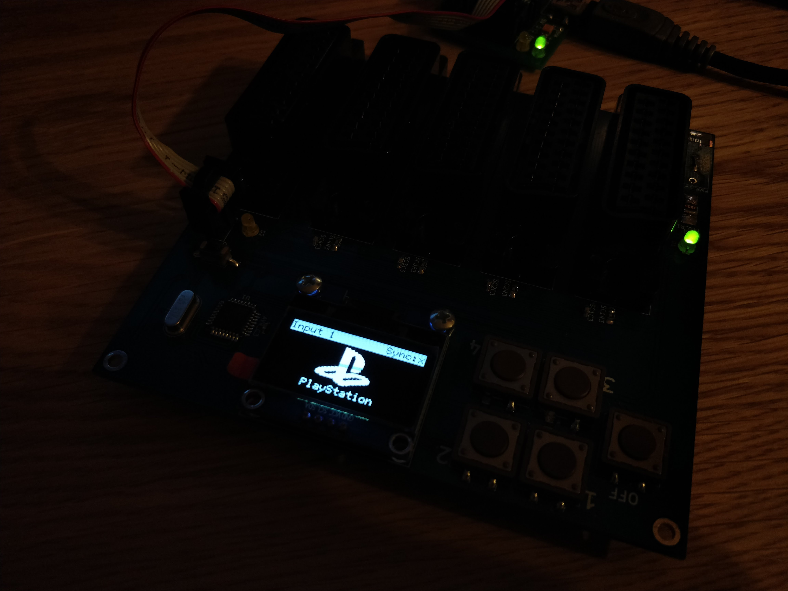

# RGB Switch
This is a pretty basic RGB Switch design based on CBT3244AD bus switch ICs, SH1106 I²C screen, MAX7461 Loss-of-Sync detector IC and ATmega328p microcontroller.

Uses hardware-accelerated I2C **[library](https://github.com/jeremycole/avr)** by [Jeremy Cole](https://github.com/jeremycole) and **[u8g2 library](https://github.com/olikraus/u8g2)** by [olikraus](https://github.com/olikraus)

# Notes

Sync detection and automatic switching are based on MAX7461.

Note that MAX7461 doesn't detect 31 kHz sync signals, so automatic detection can't be used with something like Dreamcast VGA to RGBs adaptors/cables.

File that contains XBM images (*xbm.h*) is not included due to possible copyright issues I don't want to deal with.

# Images

You can find more examples of screen functionality in *extra/pictures*

